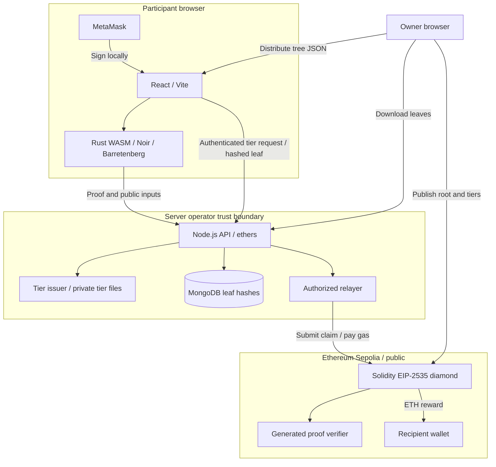

# Private Airdrop

**Claim an ETH reward without publishing the wallet used to register.**

An ordinary airdrop can link an eligible wallet to the address receiving its reward. This project explores a different flow: register a hashed leaf off chain, prove membership privately in the browser, and let a relayer send the claim to a chosen recipient.

**Research question:** How can a participant prove eligibility for a reward while disclosing less about the wallet and registration witness? The airdrop is a test case for this question. A spent nullifier prevents the same claim from being reused within an airdrop; repeated participation with new registration inputs and Sybil resistance remain unresolved.

It is an undergraduate protocol prototype on **Ethereum Sepolia**, not an audited payment service. The proof hides the registration witness from the blockchain, but the current tier issuer can still link its requests to claims. It does not prevent one person from using several wallets.

## Review guide

| Resource | Where to start |
| --- | --- |
| Demo | [Run locally](#run-locally), then [explore the interface](#explore-the-interface). The read-only demo requires MetaMask on Sepolia. |
| Technical report | [Read the technical report (PDF)](research/Private-Airdrop-Technical-Report.pdf). |
| Architecture | [Component and trust-boundary diagram](#architecture-and-technologies) below. |
| Test instructions | [Automated checks and manual demo procedure](#verification). |
| Security limits | [Threat model](#threat-model) and [what the system does not guarantee](#what-the-system-does-not-guarantee). |

[View the deployed diamond](https://sepolia.etherscan.io/address/0x0b8999649188D5A4d562638f833dEA45622a7D65#code) · [Deployment addresses](packages/contracts/deployment-sepolia.json)

## Architecture and technologies



The browser builds the private witness and proof; the server issues tier keys, stores leaves and relays claims. The diamond routes calls to admin/user facets and checks proofs through the generated verifier. The issuer and relayer share an operator, so their separation into modules is not a privacy boundary. Owners build the final tree locally and distribute it outside the API.

The stack uses React 19, Vite 8, ethers 6, Node.js, MongoDB, Rust/WebAssembly, Noir **1.0.0-beta.26**, Barretenberg **5.2.0**, Solidity and Foundry. pnpm manages the JavaScript workspace. Keep circuit, WASM, verifier and proof artifacts aligned; see the package build guides below.

## The workflow

1. **Create.** An owner enters the name, budget and reward tiers. Only the name and budget go on chain; tiers are saved privately on the server.
2. **Register.** A participant chooses a secret and seed, requests a tier key, downloads a registration backup, and sends one hashed leaf to the server. Registration is not a blockchain transaction.
3. **Open claims.** The owner closes registration, builds and downloads the Merkle tree, then publishes its root and tier keys/rewards on chain.
4. **Prove and claim.** The participant imports their backup and the owner's tree file, chooses a different recipient, signs with the original wallet, and generates a proof locally. The server relays the claim; the contract verifies it and pays the reward.

The tree holds up to **256 leaves**. Unused positions are filled deterministically; they are not additional participants. The owner distributes the final tree JSON so participants can find their paths locally.

## Explore the interface

Connect MetaMask on **Sepolia, chain ID 11155111**. The app reads your role from the contract.

| Access | What you can do |
| --- | --- |
| Participant | Register, prepare a proof and request a relayed claim. |
| Read-only demo | Browse the same admin screens without changing server or contract state. A wallet is still required. |
| Demo admin | Request a role through the enabled faucet, then create and manage real testnet airdrops. |
| Super owner | Also manage permanent owners, demo access, upgrades and pool withdrawals. |

The faucet grants a role, not ETH. Demo admin transactions need Sepolia ETH. All owners can manage all airdrops, so a shared demo is not an isolated sandbox.

## Run locally

Use **Node.js 22.12+**, pnpm, MetaMask and MongoDB. From this directory:

```sh
git submodule update --init --recursive
pnpm install --frozen-lockfile
```

Copy `.env.example` to `.env` in `packages/server` and `packages/web`. Set MongoDB access and a Sepolia RPC. Both packages must use the same diamond address. The server's relayer key must belong to the wallet authorized by that diamond; a frontend alone cannot replace the deployed instance's server.

Start the API and frontend in separate terminals:

```sh
pnpm --filter @airdrop/server dev
```

```sh
pnpm --filter @airdrop/web-app dev
```

Open the URL printed by Vite. For an independent instance, follow the [contract deployment guide](packages/contracts/README.md). For missing WASM assets, follow the [crypto build guide](packages/crypto-lib/README.md).

**Fund two places before claiming:** the diamond pool pays rewards, while the relayer wallet pays gas. Budgets are spending caps, not reserved deposits. Use Access & pool to inspect and fund the pool.

## Repository

Each package README contains its setup, build and test commands.

| Package | Purpose |
| --- | --- |
| [circuits](packages/circuits/) | Noir ownership, membership and nullifier constraints, with native tests. |
| [crypto-lib](packages/crypto-lib/) | Rust/WASM normalization, hashing, signatures and Merkle helpers. |
| [contracts](packages/contracts/) | Admin/user facets, diamond, verifier, role faucet and deployment. |
| [server](packages/server/) | MongoDB leaf storage, private tier issuance and claim relaying. |
| [web](packages/web/) | React interface, wallet integration and browser proving. |

## Verification

From the repository root, after installing dependencies:

```sh
# Noir tests (regenerates fixtures through Rust)
pnpm test

# Rust helpers
cargo test --locked --manifest-path packages/crypto-lib/Cargo.toml

# Contract policy and real-verifier tests
forge test --root packages/contracts

# Frontend production build
pnpm --filter @airdrop/web-app build
```

Use the toolchain versions in the [circuit](packages/circuits/README.md), [Rust/WASM](packages/crypto-lib/README.md) and [contract](packages/contracts/README.md) guides. On Windows, run direct Cargo/Foundry commands in WSL; the Noir test wrapper invokes WSL itself. `pnpm test` runs only the Noir suite, not all checks above. The frontend build checks bundling, not browser behavior. There are no separate automated server or web test suites.

For a manual end-to-end demo, use a writable owner role and a funded Sepolia deployment:

1. Start MongoDB, the API and the frontend using [Run locally](#run-locally). Fund the diamond reward pool and the authorized relayer's gas wallet separately.
2. As an owner, create an airdrop and save its tiers. As a participant, register and save the registration backup.
3. As an owner, close registration, download the tree and publish its root and tiers. Give the tree JSON to the participant.
4. As the participant, import the backup and tree, choose a different recipient, sign and generate the proof. Submit the relayed claim.
5. Check the successful transaction receipt, `Claimed` event and recipient payout. Retry the same claim: it must be rejected without a second payout. Record the airdrop ID, transaction hash and result for review; keep the registration backup private.

Read-only demo mode supports interface review only; it cannot complete this procedure.

The checked suites contain **60 Noir tests, 6 Rust helper tests and 23 Solidity tests**. They cover input agreement, membership, signatures, permissions, replay rejection and payout rules. Solidity includes tests against a real generated verifier and proof; the application-policy tests also use a verifier double. Counts are not coverage percentages or an audit.

The Sepolia deployment has verified sources for all seven contracts, including the verifier's two libraries. On-chain checks confirmed the facet routes and accepted a real proof through the live verifier. This is distinct from completing an entire funded claim on the live deployment.

## Threat model

The assets are participant witnesses, correct reward payment, unspent nullifiers and administrative keys. Protection assumes sound cryptography, matching circuit/verifier artifacts, an uncompromised browser and wallet, and correct execution of the deployed contracts.

| Actor or threat | Protection and trust boundary |
| --- | --- |
| Public blockchain observer | Proofs hide the registration witness; recipient, nullifier, tier key, root, reward and transaction timing remain public. |
| Dishonest claimant | The circuit checks ownership and membership; the contract checks reward entitlement and rejects a spent nullifier within that airdrop. This does not establish a unique person. |
| Curious or malicious operator | The issuer sees the authenticated wallet and nullifier, enabling claim linkage. The relayer can withhold submission. |
| Malicious administrator | Owners control inclusion and tiers; the super owner can upgrade code and withdraw funds. Fair administration is trusted. |
| Compromised client or network observer | Witness secrecy depends on the client; transport metadata, RPC observations and request logs are outside proof-level protection. |

## Privacy guarantees

Under these assumptions, the proof establishes ownership of the committed wallet, membership in the published root and correct nullifier construction without publishing the wallet public key, signature, secret, seed or Merkle path. The recipient is bound to the proof, and the authorized relayer pays submission gas. MongoDB participant records retain leaf hashes rather than those private witnesses. These are limited data-disclosure properties, not end-to-end anonymity.

## What the system does not guarantee

- Participant records contain only leaf hashes, but the issuer observes a wallet-authenticated nullifier request. **The operator can link it to a later claim.**
- The contract prevents reuse of a nullifier within an airdrop, not multiple identities or registrations. Use fresh secrets and seeds across airdrops to avoid a repeated public nullifier.
- Owners choose the accepted tree. The super owner can upgrade contracts and withdraw shared funds; the service depends on issuer and relayer availability.
- Published tier data makes rewards discoverable. Delaying their display in the UI is not reward encryption.
- A fresh recipient is not necessarily anonymous: known addresses, later transfers, timing and small participant sets can reveal links. Padding a tree does not add real participants. The UI rejects the registration wallet as recipient, but the circuit does not enforce that inequality.
- Registration does not prove eligibility or ownership at admission. Arbitrary leaves can occupy the 256 available slots; there is no Sybil or capacity-abuse defense.
- There is no forced inclusion, dispute mechanism, guaranteed availability or guaranteed payout. Owners can omit leaves or publish mismatched tiers, and shared pool funds are not reserved per airdrop.
- A compromised frontend, wallet, leaked backup or weak/reused secrets can defeat witness privacy. The prototype is not audited or production-ready; passing tests is not a security proof.

The [technical report](research/Private-Airdrop-Technical-Report.pdf) explains the protocol, evidence and trade-offs in depth. Keep registration backups and server keys private; never place secrets in `VITE_` variables or commit `.env` files.
